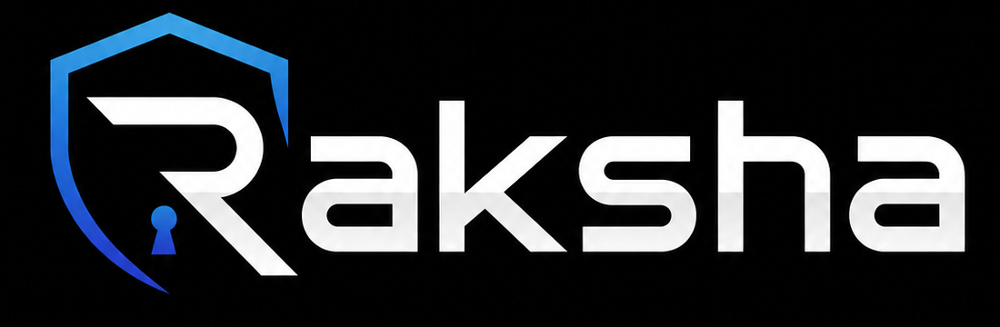
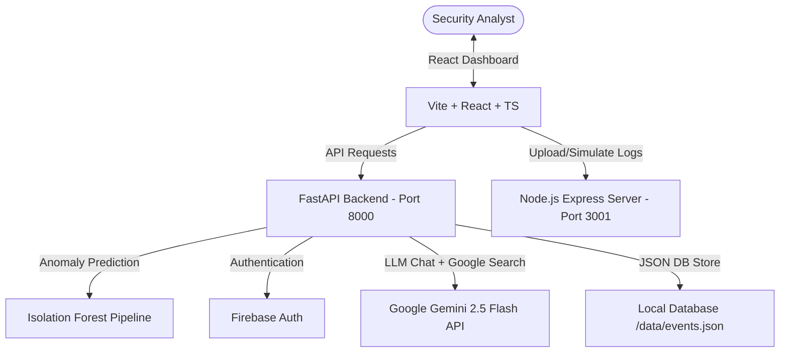

<p align="center">
  
</p>

<h1 align="center">Raksha — Autonomous AI Threat Detection & Incident Correlation Platform</h1>

<p align="center">
  <strong>An advanced, end-to-end security operations center (SOC) solution combining machine learning anomaly detection with Google Gemini AI agents to detect, correlate, and contain cyber threats in real-time.</strong>
</p>

<p align="center">
  
  
  
  
</p>

---

## 📌 Problem Statement & The Solution

### The Challenge in Security Operations (SOC)
Modern cybersecurity teams are overwhelmed with thousands of security logs daily, a phenomenon known as **alert fatigue**. Critical indicators of compromise (IoCs) get lost in the noise. Furthermore, correlating isolated events (like a failed login at 2 AM and a database access at 3 AM) into a cohesive multi-stage attack path is traditionally a slow, manual process, giving malicious actors ample time to exfiltrate sensitive data.

### Our Solution: Raksha
**Raksha** (meaning "Protection" or "Guard") is a state-of-the-art security operations dashboard and automation platform. It resolves alert fatigue by:
1. **Detecting Anomalies**: Using an **Isolation Forest Machine Learning model** trained on normal user activities to flag deviations.
2. **Correlating Multi-Stage Incidents**: Clustering isolated alerts into a single cohesive incident timeline using a custom graph-correlation engine.
3. **Visualizing the Kill Chain**: Mapping active threats dynamically to the **MITRE ATT&CK Matrix** (Initial Access, Credential Stealing, Lateral Movement, Exfiltration).
4. **Triaging with AI Copilot**: Equipping analysts with a context-rich **Gemini 2.5 Flash agent** integrated with **Google Search** to research zero-days and CVE databases on the fly.
5. **Autonomously Containing Threats**: Providing containment playbooks (lock user accounts, reset passwords, block unrecognized device fingerprints, forensic snapshots) to shut down attackers in seconds.

---

## ✨ Core Features & Modules

### 1. Unified SOC Overview & Telemetry Dashboard
* **Dynamic Visualizations**: Real-time charts detailing alert frequency, severity distribution (Critical, High, Medium, Low), and system latency.
* **Live Threat Ticker**: Telemetry feed showing continuous mock network activity and active attack vectors targeting assets.

### 2. Interactive Security Lab & ML Sandbox
* **Manual Simulation**: Input customized activity parameters (failed logins, unknown device fingerprint, download volume, sensitive file access) to test the detector.
* **Log File Detonation**: Drag-and-drop log files to simulate batch static threat analysis.
* **Real-time Pipeline Pipeline**: Step-by-step interactive animations showing the threat analysis pipeline:
  `Data Collection` ➔ `ML Anomaly Classification` ➔ `Risk Assessment` ➔ `AI Prompt Enrichment` ➔ `Security Event & Incident Creation`.

### 3. Graph-Based Attack Correlation & Playbook Containment
* **Temporal Clustering**: Correlates security events from the same user occurring within 15-minute windows into structured incident summaries.
* **One-Click Remediation**: Playbook wizard allowing analysts to lock accounts, block unrecognized devices, notify security teams, or snapshot databases.
* **Forensic Timelines**: Chronological details of each attack step with severity alerts.

### 4. MITRE ATT&CK Matrix Mapping
* **Dynamic Stage Highlighting**: Visual mapping of active attacks to their corresponding MITRE technique (TA0001 to TA0010).
* **Deep Forensic Drill-Down**: Interactive cards displaying originating IP, target asset, forensic evidence, and attack description.
* **AI Copilot Handoff**: Instantly transfer details of a specific matrix technique to the Copilot for immediate advice.

### 5. Context-Aware AI Copilot (Gemini 2.5 Flash)
* **Live Environment Data**: The chatbot is injected with active database incidents and security events metadata.
* **Google Search Tool**: If queried about real-world cybersecurity news, zero-days, or CVE vulnerabilities, the agent runs a live search to get up-to-date threat intel.
* **Professional SOC Personality**: Custom system prompt ensuring bullet-pointed, senior security analyst responses under 200 words.

### 6. Automated PDF & CSV Reporting
* Generates incident summaries on the fly and exports them as **structured CSV files** or **formal PDF reports** built with `jsPDF` for stakeholder handoff.

---

## 🛠️ Architecture & Tech Stack



* **Frontend**: React (v19), TypeScript, Vite, Tailwind CSS, Recharts, Lucide React, React Router (v7).
* **ML & App Server**: FastAPI, Uvicorn, Python 3.9+, Scikit-Learn, Pandas, Joblib, Google GenAI SDK.
* **Security Lab Backend**: Node.js, Express, Multer (Static file upload & heuristic analyzer).
* **Database & Auth**: Firebase Authentication & JSON data persistence.

---

## 🧠 Machine Learning Engine (Anomaly Detection)

Raksha does not rely solely on simple thresholds to detect threats. It trains an **Isolation Forest** (an unsupervised anomaly detection model based on decision trees) in Python using normal employee behavior baselines.

### 📊 Features Analyzed:
1. `login_hour` (0–23): Checks for unusual working hours (e.g., late-night logins).
2. `failed_logins` (Integer): Identifies possible brute-force activities.
3. `known_device` (0 or 1): Flags unknown hardware fingerprints.
4. `download_mb` (Integer): Flags massive outbound data volumes.
5. `sensitive_file_access` (0 or 1): Checks if vital files (like `/etc/passwd`) are accessed.
6. `antivirus_active` (0 or 1): Flags disabled endpoint protection systems.

### 📈 ML Scoring logic:
* The model returns a prediction value of `-1` (Anomaly) or `1` (Normal).
* Anomaly scores are mapped to a scale of `0–100` based on the decision function distance:
  $$\text{Anomaly Score} = \max(0, \min(100, 50 - (\text{raw\_score} \times 200)))$$
* Combined with direct cybersecurity heuristics, a final consolidated risk score determines the severity levels (`Low`, `Medium`, `High`, `Critical`).

---

## ⚙️ Local Setup & Installation

Follow these steps to run the complete platform locally.

### Prerequisites:
* **Node.js** (v18+)
* **Python** (v3.9+)
* **Google Gemini API Key** (Get one from [Google AI Studio](https://aistudio.google.com/))

### 1. Clone & Set Up the Root Frontend
```bash
# Clone the repository
cd Cyber-1

# Install frontend dependencies
npm install

# Start the Vite React development server
npm run dev
```
*Frontend runs at:* **http://localhost:5173**

---

### 2. Set Up the Python FastAPI Backend
Open a separate terminal window:
```bash
# Navigate to the backend directory
cd backend

# Create a virtual environment
python -m venv venv
# Activate it (Windows)
.\venv\Scripts\activate
# Activate it (Mac/Linux)
source venv/bin/activate

# Install requirements
pip install -r requirements.txt

# Run the dataset generation script (to create normal baseline data)
python generate_dataset.py

# Train the ML Isolation Forest model
python train_model.py
```

Create a file named `.env` in the `backend/app/` folder and paste your Gemini API Key:
```env
GEMINI_API_KEY=your_gemini_api_key_here
```

Start the API server:
```bash
# From the backend directory, run:
uvicorn app.main:app --reload --port 8000
```
*FastAPI server runs at:* **http://localhost:8000** (Vite handles proxying automatically).

---

### 3. Set Up the Security Lab Server (Express)
Open a separate terminal window:
```bash
# Navigate to the Express server directory
cd security-lab-server

# Install dependencies
npm install

# Start the Node server
npm start # or 'npm run dev'
```
*Express server runs at:* **http://localhost:3001**

---

## 📂 Project Structure

```text
Cyber-1/
├── src/                      # Frontend React + TypeScript
│   ├── components/
│   │   ├── dashboard/        # Charts, Mitre Maps, Tables
│   │   └── layout/           # Navbar, Sidebar, Page Layout
│   ├── pages/                # Pages (alerts, lab, investigation, copilot, etc.)
│   ├── contexts/             # Firebase Auth Contexts
│   ├── firebase.ts           # Firebase connection configuration
│   ├── App.tsx               # Client Router
│   └── main.tsx
├── backend/                  # FastAPI & Machine Learning
│   ├── app/
│   │   ├── models/           # anomaly_model.joblib (trained pipeline)
│   │   ├── services/         # Risk engine, correlation logic, AI summary
│   │   ├── schemas/          # Pydantic data schemas
│   │   ├── data/             # CSV dataset and live events/incidents JSON stores
│   │   ├── main.py           # FastAPI central app
│   │   └── .env              # Gemini API Configuration
│   ├── generate_dataset.py   # Synthesizes employee behavior
│   ├── train_model.py        # ML Training pipeline script
│   └── requirements.txt      # Python dependencies
├── security-lab-server/      # Standalone Threat Testing Server
│   ├── server.js             # Express API
│   ├── package.json
│   └── README.md
├── package.json              # Frontend package configuration
├── vite.config.ts            # Vite proxy middleware settings
└── README.md                 # Project README
```

---

## 🚀 Demo Walkthrough

Experience Raksha's core capabilities end-to-end in 6 steps:

1. **Simulate a Threat in the Lab**:
   * Navigate to the **Security Lab** page.
   * Enter: Login hour = `02:00` (late night), Failed logins = `8` (brute force), Known device = `0` (unknown), Download = `8000 MB` (high volume), Sensitive file access = `/etc/passwd`.
   * Click **Analyze Activity** and watch the 5-step real-time pipeline classify it as a **Critical Anomaly** (Isolation Forest model execution).
2. **Review the Correlated Incident**:
   * Go to **Attack Correlation** or **Investigation** in the sidebar.
   * You'll find a new correlated incident: `Possible Account Compromise leading to Data Exfiltration` with a complete timeline.
3. **Execute containment**:
   * Click **Take Action** on the incident card.
   * Go through the wizard: Lock Account ➔ Block Device Fingerprint ➔ Reset User Password ➔ Snapshot Server.
   * Observe the status update to `✓ Contained` and the chronological updates added to the forensic logs.
4. **Observe MITRE Mapping**:
   * Go to the **MITRE ATT&CK Matrix** page.
   * See the stages highlighted dynamically from `Initial Break-In` to `Stealing Data`.
   * Click on any card (e.g. `Stealing Data (TA0010)`) and click **Send to Copilot**.
5. **Chat with AI Copilot**:
   * On the **AI Security Co-Pilot** page, ask Raksha about the incident: *"Tell me about the recent exfiltration threat on Employee-021"*. It will outline the forensic events from the active JSON DB.
   * Ask about external threat news: *"Are there any new Zero-day vulnerability trends in 2026?"* - see the Gemini agent activate Google Search in real-time to return recent web news directly in the chat panel.
6. **Generate Formal Report**:
   * Navigate to **Reports** and click **Download PDF** next to the incident. You will receive an exportable security PDF.

---

## 🏆 Key Highlights
* **Zero Cold-Starts**: Automated fallback heuristics ensure the app functions smoothly even if the Python ML server is disconnected.
* **Production-Grade UI**: Built using rich glassmorphism details, emerald-green custom themes, dashboard charts, animated progress gauges, and custom terminal feed interfaces.
* **Extensible & decoupled**: Separating the heavy ML computation (FastAPI) and the static threat sandbox (Express) matches real-world microservice SOC architectures.

*Made with ❤️ for ET-AI hackathon 2.0*
